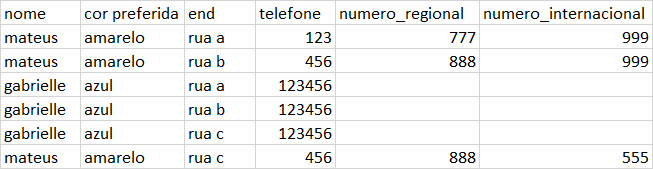

---
Atention - this module build dynamic functions
caution to use content to have computing commands
---

Execute locally to knowloge:
[run_locally](./example-of-run/en-example-of-run-xlsx-to-json.md)


---

Example of xlsx:




Example of map passed:

```
{
        "##clientes": [
            {
                "@@nome": "$$nome",
                "##telefone": [
                    {"@@numero": "$$telefone",
                     "##ligacoes_locais":[
                         {
                             "@@numero_regional": "$$numero_regional"
                         }
                       ],
                     "##ligacoes_internacionais":[
                          {
                             "@@numero_internacional": "$$numero_internacional"
                          }
                     ]
                    }
                ],
                "##enderecos": [
                    {"@@endereco": "$$end"}
                ]
            }
        ]
    }
```

Output:

```
{
    "##clientes": [
        {
            "@@nome": "mateus",
            "##telefone": [
                {
                    "@@numero": "123",
                    "##ligacoes_locais": [
                        {
                            "@@numero_regional": "777.0"
                        }
                    ],
                    "##ligacoes_internacionais": [
                        {
                            "@@numero_internacional": "999.0"
                        }
                    ]
                },
                {
                    "@@numero": "456",
                    "##ligacoes_locais": [
                        {
                            "@@numero_regional": "888.0"
                        }
                    ],
                    "##ligacoes_internacionais": [
                        {
                            "@@numero_internacional": "999.0"
                        },
                        {
                            "@@numero_internacional": "555.0"
                        }
                    ]
                }
            ],
            "##enderecos": [
                {
                    "@@endereco": "rua a"
                },
                {
                    "@@endereco": "rua b"
                },
                {
                    "@@endereco": "rua c"
                }
            ]
        },
        {
            "@@nome": "gabrielle",
            "##telefone": [
                {
                    "@@numero": "123456",
                    "##ligacoes_locais": [
                        {
                            "@@numero_regional": "nan"
                        }
                    ],
                    "##ligacoes_internacionais": [
                        {
                            "@@numero_internacional": "nan"
                        }
                    ]
                }
            ],
            "##enderecos": [
                {
                    "@@endereco": "rua a"
                },
                {
                    "@@endereco": "rua b"
                },
                {
                    "@@endereco": "rua c"
                }
            ]
        }
    ]
}

```

```
    $$ -> name of colun in xlsx
    @@ -> aggregation identify
    ## -> list identigy (where will be happen "join")
```


```
RULES:
    - LIST NEED TO BE ONLY A ONE OBJECT INTER (LIKE PATTERN OF AGREGATION)
    - IT'S NOT PERMITTED EMPTY LISTS
    - ALWAYS DO YOU HAVE A LIST, IS NECESSARY TO SPECIFY AGGREGATION TAG LIKE (@@)  
      IN OBJECT INSIDE OF LIST
    - IF YOU HAVE AGGREGATION LIST YOU NEED TO PUT THIS IN FIRST LAYER
      
```
 
- you can't put the main object in the "second layer", for example:


INVALID:
```
{
        "ProfessorXavier:{
            "##lidera": [
                {
                    "nome": "vampira"
                },
                {
                    "nome": "noturno"
                }
            ]
        }
}
```

VALID:
```
{
        "nome: "ProfessorXavier,
        "##lidera": [
            {
                "nome": "vampira"
            },
            {
                "nome": "noturno"
            }
        ]
}
```

The software will be search the lists in the "first layer" of map passed\
if your list in the second layer please put this in the first layer by the rules.
