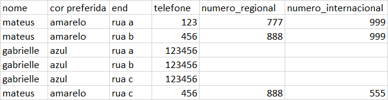

---
Atenção - Este módulo constroi funções dinamicamente
cuidado ao utilizar jsons que possuem comandos de computador
em suas variaveis
---

Execute localmente para o entendimento:
[execute localmente](doc/example-of-run-xlsx-to-json.md)


---

Exemplo de xlsx:




Exemplo de mapa passado:

<details>
  <summary>JSON MAPA</summary>

```
{
        "##clientes": [
            {
                "@@nome": "$$nome",
                "##telefone": [
                    {"@@numero": "$$telefone",
                     "##ligacoes_locais":[
                         {
                             "@@numero_regional": "$$numero_regional"
                         }
                       ],
                     "##ligacoes_internacionais":[
                          {
                             "@@numero_internacional": "$$numero_internacional"
                          }
                     ]
                    }
                ],
                "##enderecos": [
                    {"@@endereco": "$$end"}
                ]
            }
        ]
    }
```
</details>

Saída:

<details>
  <summary>SAIDA</summary>

```
{
    "##clientes": [
        {
            "@@nome": "mateus",
            "##telefone": [
                {
                    "@@numero": "123",
                    "##ligacoes_locais": [
                        {
                            "@@numero_regional": "777.0"
                        }
                    ],
                    "##ligacoes_internacionais": [
                        {
                            "@@numero_internacional": "999.0"
                        }
                    ]
                },
                {
                    "@@numero": "456",
                    "##ligacoes_locais": [
                        {
                            "@@numero_regional": "888.0"
                        }
                    ],
                    "##ligacoes_internacionais": [
                        {
                            "@@numero_internacional": "999.0"
                        },
                        {
                            "@@numero_internacional": "555.0"
                        }
                    ]
                }
            ],
            "##enderecos": [
                {
                    "@@endereco": "rua a"
                },
                {
                    "@@endereco": "rua b"
                },
                {
                    "@@endereco": "rua c"
                }
            ]
        },
        {
            "@@nome": "gabrielle",
            "##telefone": [
                {
                    "@@numero": "123456",
                    "##ligacoes_locais": [
                        {
                            "@@numero_regional": "nan"
                        }
                    ],
                    "##ligacoes_internacionais": [
                        {
                            "@@numero_internacional": "nan"
                        }
                    ]
                }
            ],
            "##enderecos": [
                {
                    "@@endereco": "rua a"
                },
                {
                    "@@endereco": "rua b"
                },
                {
                    "@@endereco": "rua c"
                }
            ]
        }
    ]
}

```
</details>


```
    $$ -> nome da coluna na planilha
    @@ -> identificador de agregação
    ## -> identificador de lista (onde acontecerá a "junção")
```


```
REGRAS:
    - AS LISTAS PRECISAM TER APENAS UM OBJETO INTERNO 
    - NÃO SÃO POSSÍVEIS LISTAS VAZIAS
    - SEMPRE QUE IDENTIFICAR UMA LISTA, VC PRECISA 
      ESPECIFICAR UM IDENTIFICADOR AGREGADOR (@@) NO OBJETO INTERNO DENTRO DA LISTA
    - CASO TENHA UMA LISTA AGREGADORA, VOCÊ PRECISA COLOCAR ELA NO PRIMEIRO NÍVEL
      
```
 
- você não pode deixar seu objeto principal em um nível inferior, por exemplo:


INVALIDO:
```
{
        "ProfessorXavier:{
            "##lidera": [
                {
                    "nome": "vampira"
                },
                {
                    "nome": "noturno"
                }
            ]
        }
}
```

VALIDO:
```
{
        "nome: "ProfessorXavier,
        "##lidera": [
            {
                "nome": "vampira"
            },
            {
                "nome": "noturno"
            }
        ]
}
```

O Software vai sempre buscar AS LISTAS no primeiro nível do objeto mapa\
se sua lista estiver em uma camada inferior, suba ela de nível de uma forma inteligente
respeitando as regras
